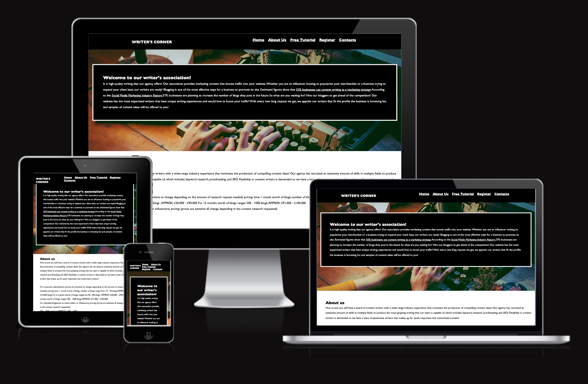
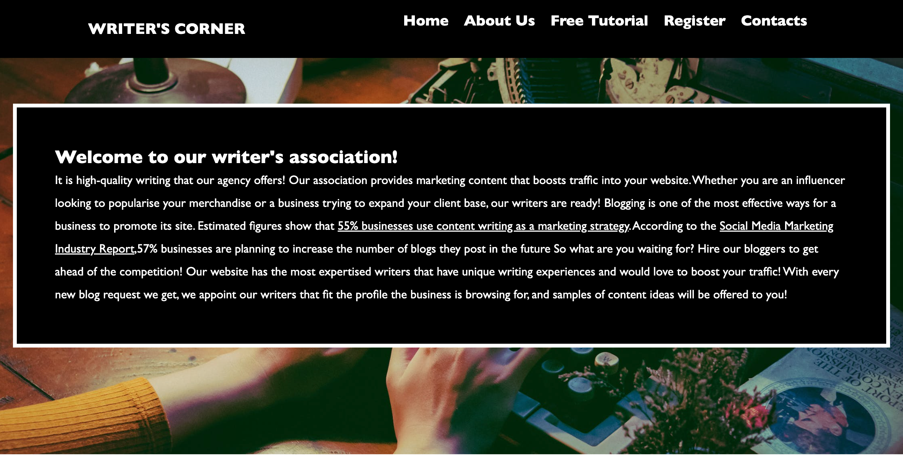
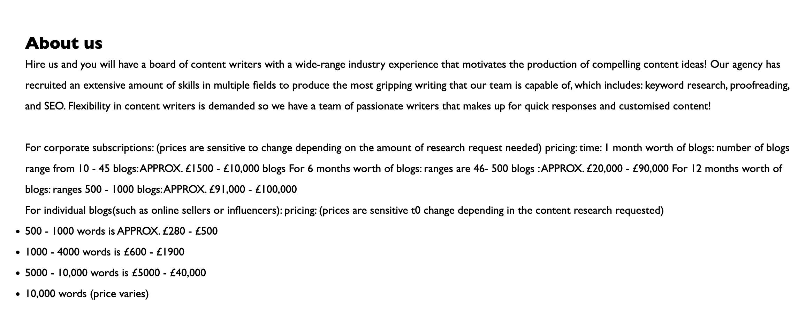
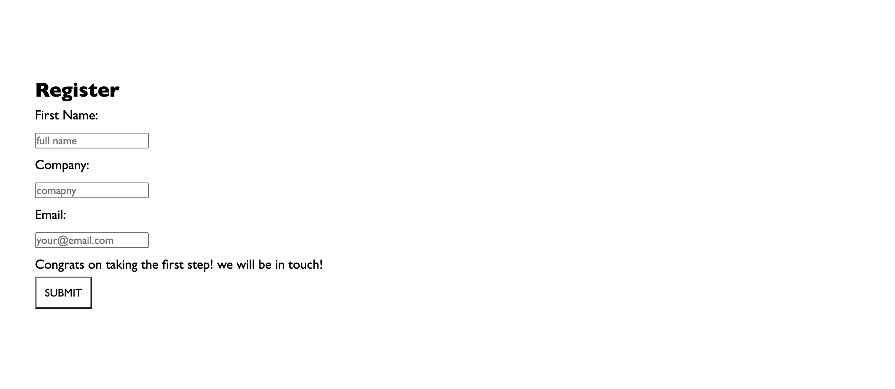
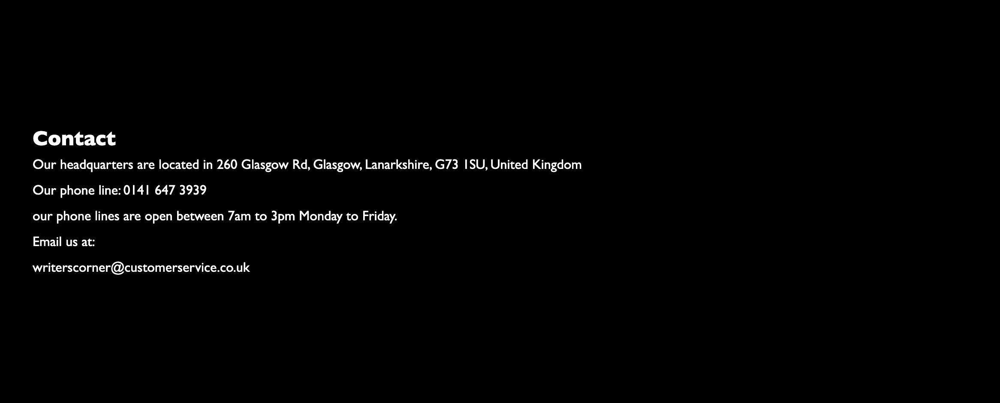

## Writer's corner
Welcome to the Writer's corner!
THis website feature an agency of bloggers witha variety of industry-expertise that can be hired by enetrprises and offers a group of writers as one their services.

## Features

### Navigation Bar

The Navigation bar is featured on each page (home, contacts, about, tutorial and register). The navigation allows users to move across the single page site with ease. The navigation bar is fixed to the top of the page to improve usability.

### Footer Section

The footer section contains links to facebook and twitter. This allows users to follow the page on the respective social sites.

### Background image
The background image is included in the first section. The image features a writer at work and provides a visually appealing element that conforms to the theme of the site.

### Home Section

The homepage introduces the customer to some interesting insight on the influence of blogging by introducing statistics to appeal to the marketer clients.

### About Section

The about us webpage explains what our price ranges are for individuals and enterprises.

### Tutorial Section
The about video is intended to feature a video of on of the art classes. Currently I am using a placeholder video for the purpose of this project.

### Register Section

Potential customers can submit their information to enquire about services of the site. The customer can submit their

- Name
- Company
- Email

The registration form includes a submit button to send their information to us. 

### Contacts Section

Our contacts show the means of the communication for the customer to get in touch. The information includes the company address and number

## Testing 

### Validator Testing 

- HTML
  - No errors were returned when passing through the official [W3C validator](https://validator.w3.org/nu/)
- CSS
  - No errors were found when passing through the official [(Jigsaw) validator](https://jigsaw.w3.org/css-validator/validator)
- Screen compatibility 
    - I have checked that the screen compatibility using the website, 'AM I RESPONSIVE?' [website](https://ui.dev/amiresponsive)
- Performance
    - The site performace was tested on lighthouse and received a score of 84.[website](https://googlechrome.github.io/lighthouse/viewer/). 
    

## Deployment procedure

The application is deployed by configuring github to use the main branch for a github pages site.

## Credits

### Images
The images were found on [google](https://google.com) and pexels.com
- Background image: [pexels](https://www.pexels.com/photo/person-using-typewriter-1448709/)
- Tutorial video:  [pexels](https://www.pexels.com/video/a-man-using-writing-on-the-notebook-6549275/)

